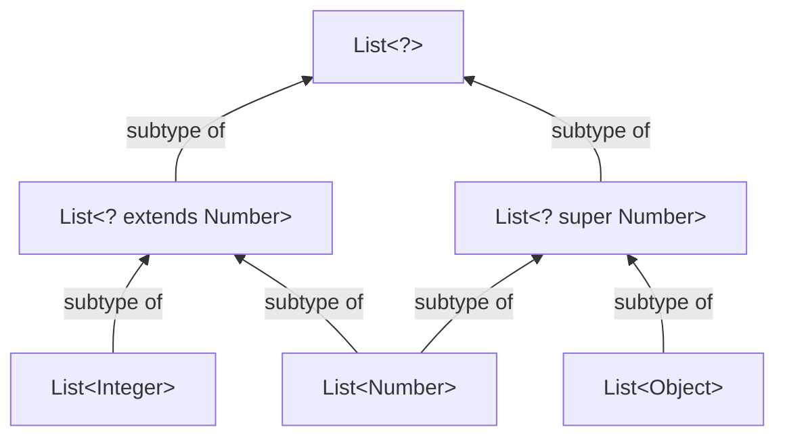
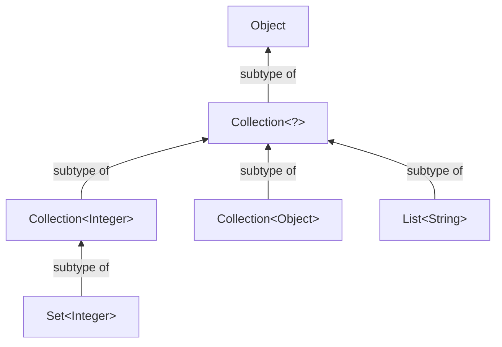

# Wildcards

Wildcards (`?`) allow flexibility in generic types.

```java
interface Collection<E> {
    public boolean addAll(Collection<? extends E> c);
    // ...
}
```

The `addAll()` method in `Collection<E>` uses `? extends E`, meaning it can accept a collection containing elements of `E` or any of its subtypes. This ensures type safety while enabling broader compatibility.

The `?` wildcard is essential for handling generics efficiently.

##

###

#### Example 1

```java
// We can use wildcards when declaring variables
List<Integer> ints = Arrays.asList(1,2);

// OK
List<? extends Number> nums = ints;

// error because List<Number> is NOT subtype of List<Integer>
List<Number> nums = ints;

// Compile-time error List<? extends Number> might contain other types than double
nums.add(3.14);

```

**With `? extends T`, _elements can be read from it, but new elements cannot be added_, ensuring type safety by preventing incompatible insertions.**

#### Example 2

This method copies elements from a source list to a destination list using generics.

```java
public static <T> void copy( List<? super T> destination,
                             List<? extends T> source ) {
    for (int i = 0; i < src.size(); i++) {
        destination.set(i, src.get(i));
    }
}
```

- The source list (`? extends T`) can contain elements of any subtype of `T`, ensuring safe retrieval.
- The destination list (`? super T`) can hold elements of any supertype of `T`, allowing insertion.

This approach enables flexible yet type-safe copying while maintaining compatibility between different generic types.

#### Example 3

```java
List<Object> objs = Arrays.<Object>asList(2, 3.14, "a");
List<Integer> ints = Arrays.asList(5,6);
Collections.copy(objs, ints); // No specification of type args
```

Type parameters can be omitted, and will still be inferred, so we could still explicitly specify type arguments:

```java
Collections.<Integer>copy(objs, ints); // Specifcation as Integer
Collections.<Object>copy(objs, ints);  // Specification as Object
Collections.<Number>copy(objs, ints);  // Specification as Numer
```

The third example is permitted because:

- `objs` has type `List<Object>` and `ints` has type `List<Integer>`
- `Object` is as supertype of `Number`
- `List<Object>` is a subtype of `List<? super Number>`
- `Integer`is a subtype of `Number`
- `List<Integer>` is a subtype of `List<? extends Number>`

###

## The GET and PUT Principle

    When you GET values out of a structure, use the `extends` wildcard.
    When you PUT values in to a structure, use the `super` wildcard.
    When you do both, do not use a wildcard.

The `copy( List<? super T> destination, List<? extends T> source)` method from example 2 gets values out of the source list, and puts them into the destination list.

###

#### Tricky Parts

Even though we use `extends` when we only GET things out of a structure, there's still no guarantee for immutability (no alterations), it's still possible to add `null` values, remove elements, and permute (re-arrange) it.

**Even though `String` is _final_ and can have no subtypes, `List<String>` is not the same as `List<? extends String>`, but a _subtype_ of it.**

###

#### Example 4

```java
static void printAll(List<?> list) {
  for (Object obj : list) {
    System.out.println(obj);
  }
}
```

The wildcard `<?>` is an abbreviation of `? extends Object>` and it is also a _wildcard capture_.

## The Wildcard Capture

Wildcard capture occurs when a method infers the actual type of a wildcard (`<?>`) at runtime.
Consider `Collections.reverse()`, which reverses a list of any type:

```java
public static void reverse(List<?> list);
```

Since the exact type of `<?>` is unknown, modifying the list inside this method is not allowed.

```java
// To enable modifications, we use a generic parameter
public static <T> void rev(List<T> list);

// Wildcard capture allows us to delegate:
// Here <T> captures <?>, enabling modifications.
public static void reverse(List<?> list) { rev(list); }
```

### **Restrictions on Wildcards**

Wildcards (`<?>`) are prohibited in certain cases to maintain **type safety** and **prevent ambiguity**. However, **nested wildcards** (`List<List<?>>`) are allowed in some cases.

#### **1. Instance Creation**

```java
List<?> list = new ArrayList<?>();              // ❌ Error
List<?> list = new ArrayList<Object>();         // ✅ OK: Explicit type arg (Object)
List<List<?>> lists = new ArrayList<List<?>>(); // ✅ OK: Nested wildcard
```

#### **2. Supertypes**

```java
class MyList extends ArrayList<?> { }           // ❌ Error
class MyList implements List<?> { }             // ❌ Error
class NestedList extends ArrayList<List<?>> { } // ✅ OK: Nested wildcard
```

#### **3. Generic Method Call**

```java
class Lists {
    public static <T> List<T> factory() {
      return new ArrayList<T>();
    }
}
List<?> list = Lists.<?>factory();              // ❌ Error
List<?> list = Lists.<Object>factory();         // ✅ OK: Explicit type arg (Object)
List<List<?>> lists = Lists.<List<?>>factory(); // ✅ OK: (nested wildcard)
```

### **Key Takeaways**

- **Wildcards cannot be used for direct instantiation.**
- **Supertypes must have a concrete type.**
- **Nested wildcards are allowed.**
- **Explicit type arguments must be specific.**

## Visualization of Subtypes

### Lists



### Lists, Collections, & Sets



### Wildcard Boundaries in Generics

`C<? extends T>`: Wildcard bounded above (can be any type up to `T`).
`C<? super T>`: Wildcard bounded below (can be any type not lower than `T`).

**Examples of Subtype Relations**:

1. `C<..., S, ...>` is a subtype of `C<..., ?, ...>`
2. `C<..., S, ...>` is a subtype of `C<..., ? extends T, ...>` if `S` is a subtype of `T`.
3. `C<..., S, ...>` is a subtype of `C<..., ? super T, ...>` if `S` is a supertype of `T`.
4. `C<..., ? extends S, ...>` is a subtype of `C<..., ? extends T, ...>` if `S` is a subtype of `T`.
5. `C<..., ? super S, ...>` is a subtype of `C<..., ? super T, ...>` if `S` is a supertype of `T` (i.e. if `T` is a subtype of `S`).

**Solutions**:
`C<Animal>` is a subtype of `C<?>`.
`C<Animal>` is a subtype of `C<? extends Animal>`.
`C<Animal>` is a subtype of `C<? super Dog>`.
`C<? extends Dog>` is a subtype of `C<? extends Animal>`.
`C<? super Animal>` is a subtype of `C<? super Dog>`.

```java
import java.io.*;
import java.util.*;

// Superclass
class Animal { // CODE HERE }

// Subclass extends superclass
class Dog extends Animal {/* CODE */}

// Main class
public class Main {
  public static void main(String[] args) {

    // ✅ OK: Dog[] is subtype of Animal[]
    Animal[] animalsArray = new Dog[5];

    // ❌ Error: List<Dog> is NOT subtype of List<Animal>
    ArrayList<Dog> is not a subtype of List<Animal>
    List<Animal> animalsList1 = new ArrayList<Dog>();

    // ✅ OK: List<Dog> is subtype of List<? extends Animal>
    List<? extends Animal> animalsList2 = new ArrayList<Dog>();
    List<Animal> animalsList1 = new ArrayList<Dog>();

    // print OK after compiling without error
    System.out.println("OK!");

  }
}
```

```java
// Using wildcards vs. not using wildcards
import java.util.List;
import java.util.ArrayList;

public class Main {
  public static Number sum_with_extends(List<? extends Number> list) {
    double res = 0;
    for (Number elem : list) {
      res += elem.doubleValue();
    }
    return res;
  }

  public static Number sum_without_extends(List<Number> list) {
    double res = 0;
    for (Number elem : list) {
      res += elem.doubleValue();
    }
    return res;
  }

  public static void main(String[] args) {
    List<Integer> list_A = new ArrayList<Integer>();
    list_A.add(1);
    list_A.add(2);
    list_A.add(3);
    System.out.println(sum_with_extends(list_A));    // ✅ OK: `List<Integer>` is a subtype of `List<? extends Number>`
    System.out.println(sum_without_extends(list_A)); // ❌ Error: `List<Integer>` is NOT a subtype of `List<Number>`
  }
}
```

## Bounds

A generic type parameter (e.g., `<E>`) does not automatically inherit methods from any class.

```java
// Declared *bound* that object, E, needs to be comparable (inherits compareTo())
public static <E extends Comparable<E>> void print(List<E> a, E threshold) {
    for (E element : a) {
    if (e.compareTo(threshold) < 0) {
      System.out.println(e.toString());
    }
  }
}

// ❌ ERROR: E might not have compareTo()
public static <E> void print(List<E> a, E threshold) {/* CODE */}
```

### Bounds vs. Wildcards

Bounds for type variables are indicated by keyword `extends`, while bounds for wildcards are indicated by both `extends` and `super`.

```java
// Use extend to get values from collection
// and super to put values into compareTo().
public static <T extends Comparable<? super T>> T max(
  Collection<? extends T> collection) {/* CODE */}
```

### Recursive Bounds

Consider the Subject-Observer Pattern

```java
// Type variables reference themselves in their bounds
public class Observable<S extends Observable<S, O, A>,
                        O extends Observer<S, O, A>,
                        A> {/* CODE */}

public interface Observable<S extends Observable<S, O, A>,
                            O extends Observer<S, O, A>,
                            A> {/* CODE */}
```

### Bounds for Type Variables

In order to maximize reuse of methods, signatures should be as general as
possible, so if you can replace a type parameter by a wildcard, then do so.

```java
// Without wildcards
public static <T extends Comparable<T>>T max(Collection<T> c) {/* CODE */}
// With wildcards
public static <T extends Comparable<? super T>>T max(Collection<T> c) {/* CODE */}
```

#### To know when to use wildcards, we, again follow the GET and PUT Principle:

    When you GET values out of a structure, use the `extends` wildcard.
    When you PUT values in to a structure, use the `super` wildcard.
    When you do both, do not use a wildcard.

### Multiple Bounds for Generic Parameters

```java
// Some classes the Java standard library use multiple bounds
public static <T extends Object & Comparable<? super T>> T max
(Collection<? extends T> coll) {/* CODE */ }
```

A type variable can extend multiple interfaces, but only one class becasue Java doesn't support multiple inheritance for classes "extends" behaves like "extends" for the first bound, but like "implemets" for the rest

```java
public static <S extends Readable & Closeable, T extends Appendable & Closeable>
void copy(S source, T target, int size) {/* CODE */}

// The class must be listed first, but the interfaces can come in whatever order
class SortedList<T extends Comparable<T> & Serializable> { ... }
```

The Idea is similar to multiple class constraints in Haskell. This code takes a value `x` and a list `xs`, and returns a list of strings where the elements are less than `x`.

```haskell
f :: (Show a, Ord a) => a -> [a] -> [String]
f x xs = map show (filter (<x) xs)
{-
Input: f 5 [3, 7, 2, 9, 1]
Output: ["3", "2", "1"]
-}
```

## Parameterized Classes

Here are two examples of code that returns an element of a pair.

```java
// Java
public class Pair<T, U> {
  private T a;
  private U b;

  public Pair(T t, U u) {
    this.a = t;
    this.b = u;
  }

  public T getFirst() { return this.a; }
  public U getSecond() { return this.b; }
}

Pair<String, Integer> p = new Pair<String, Integer>(”hi”, 1);
```

Type parameters `T` and `U` are declared at the beginning, not in the constructor. However, actual type arguments are passed in the constructor.

We can "forget" to write type arguments when invoking the constructor becasue `Pair` is treated as a _raw type_.

```haskell
{- Haskell -}
data Pair t u = Pair t u

getFirst :: Pair t u -> t {- Constructor -}
getFirst (Pair x y) = x

getSecond :: Pair t u -> u {- Constructor -}
getSecond (Pair x y) = y
```

Static members of a class cannot refer to type parameters becasue static members belong to the class itself, not to an instance of the class.

However, type parameters (`T`) are tied to specific instances of a generic class, i.e. a static field or method cannot rely on a type parameter since it does not belong to any specific instance.

```java
<T extends Object & Comparable<? super T>>
```

When writing `T extends Object`, we explicitly state that every `T` must at least be an `Object`, ensuring a well-defined type for `T`.

Similarly, static members need a known type at compile-time, and type parameters are unknown at that level.
