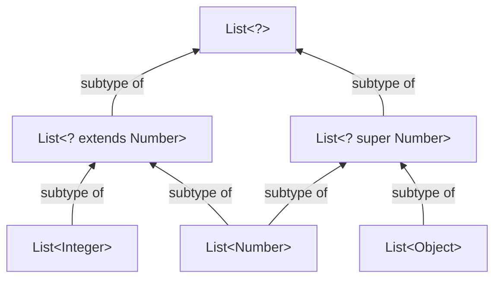
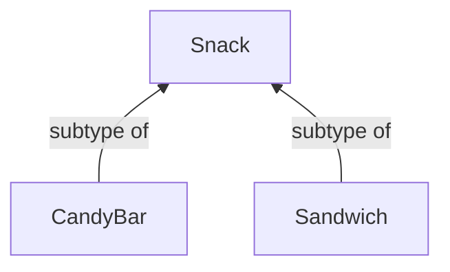
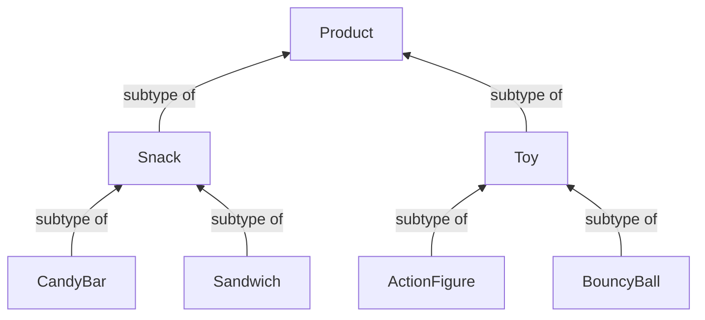
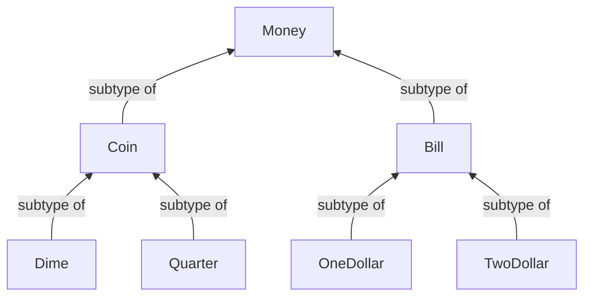

# Variance without Generics

---

> The following is based on concepts from Dave Leeds' video "[Variance without Generics](https://www.youtube.com/watch?v=6moaoAJui_4)", covering content from 00:00 to 07:20.

---

Recall from Java:



**Question**: In Kotlin, is `List<Integer>` a subtype of `List<Any>`? **NO.**

```kotlin
// Example
fun printContents(list: List<Any>) {
    println(list.joinToString())
}
printContents(listOf("abc", "xyz")) // Will this work?
```

## Co-variance (Return Type)

Assume now we have this hierarchy for snacks:



Consider the following code:

```kotlin
interface VendingMachine {
    fun purchase(money: Coin): Snack
}

class SimpleVendingMachine : VendingMachine {
    override fun purchase(money: Coin): CandyBar = Snack.random()
}

class SimpleVendingMachine : VendingMachine {
    override fun purchase(money: Coin): CandyBar = CandyBar()
}
```

A subtype can return a **more specific** type than the parent.

`SimpleVendingMachine` is a subtype of `VendingMachine` (container type), and `CandyBar` is a subtype of `Snack`(return type).

Since both become _more specific_, this is **covariance**.

---

Now, cosider this hierarchy for the contents in the vending machine, and the form of payment it is able to recieve:



## Contra-variance (Parameter Type)

Now consider these hierarchy:



A subtype can accept a **more general** type as parameter.

```kotlin
interface VendingMachine {
    fun purchase(money: Coin): Snack
}

// ❌ Error: Quarter is more specific than Coin
class SimpleVendingMachine : VendingMachine {
    override fun purchase(money: Quarter): Snack = CandyBar()
}

// ⚠️ Technically OK: Money is more general, but returning CandyBar() is not allowed
class SimpleVendingMachine : VendingMachine {
    override fun purchase(money: Money): Snack = CandyBar()
}
```

`SimpleVendingMachine` is more specific and now accepts all `Money`, not just `Coin`, and returns a `CandyBar`, not just a `Snack`.

Since the return type becomes _more specific_, while the container type _more general_, this is **contravariance**.

###

#### Function Type Properties

**Kotlin does not allow contravariance directly** because overriding methods must have identical signatures, so the solution is to use function type properties:

```kotlin
interface VendingMachine {
    val purchase: (Coin) -> Snack
}

// ✅ OK: Money is more general, and Snack.random() is more specific
class SimpleVendingMachine : VendingMachine {
    override val purchase: (Money) -> Snack = { Snack.random() }
}
```

# Variance with Generics

## Subtype Relationships

**Example:** A function expecting input of type `Any`:

```kotlin
fun f(a: Any) {
    println(a.toString())
}
```

We can pass a `String` because `String` is a subtype of `Any`.

**Example:** A function expecting input of type `List<Any>`:

```kotlin
fun printContents(list: List<Any>) {
    println(list.joinToString())
}
printContents(listOf("abc", "xyz")) // ✅ OK
```

## Covariance in Kotlin

`List<T>` is _covariant_ → If `A` is a subtype of `B`, then `List<A>` is a subtype of `List<B>`.

```kotlin
val strings: List<String> = listOf("abc", "xyz")
val anyList: List<Any> = strings // ✅ OK
```

This works because immutable lists only allow reading, not modification.

### Why Mutability Breaks This

`MutableList<T>` is not covariant

```kotlin
fun addAnswer(list: MutableList<Any>) {
    list.add(42) // ❌ Error: Potential type issue
}

val strings = mutableListOf("abc", "xyz")
addAnswer(strings) // ❌ Error: Compile-time error
```

Allowing `MutableList<String>` as `MutableList<Any>` would break type safety.

#### Key Takeaways

1. `List<T>` (immutable) is covariant (`List<String>` → `List<Any>` is valid).
2. `MutableList<T>` is _invariant_ (`MutableList<String>` ⊄ `MutableList<Any>` and vice versa).

### Variance depends on how a type is used:

**Covariant (out): Safe if only read operations are allowed (List<T>).**
**Contravariant (in): Safe if only write operations are allowed.**
**Invariant: When both read/write are used (MutableList<T>).**
