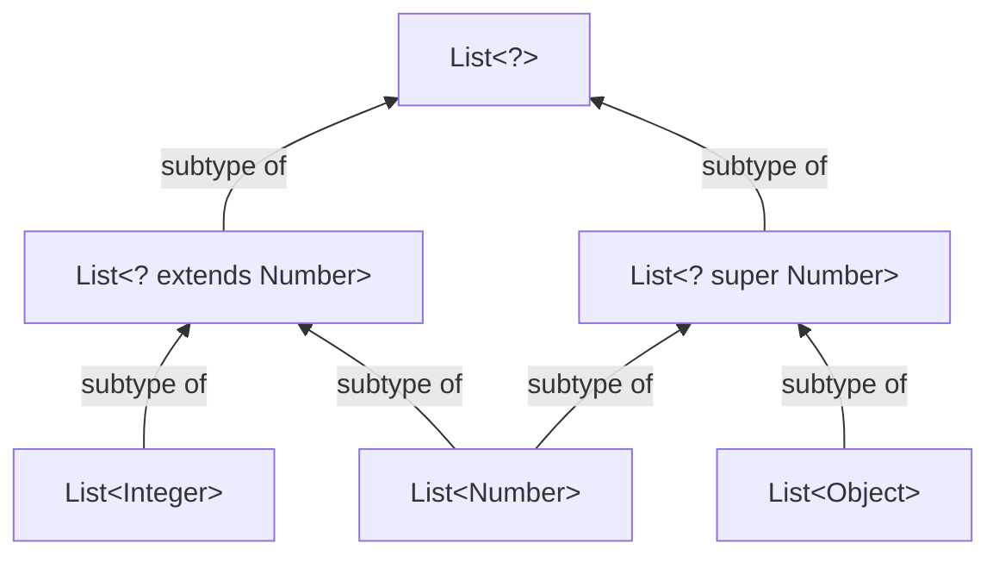
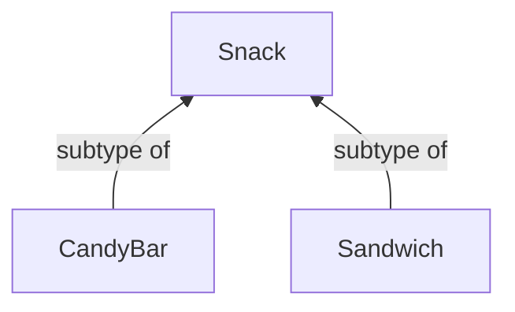
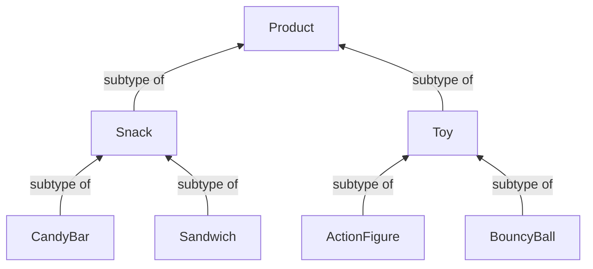
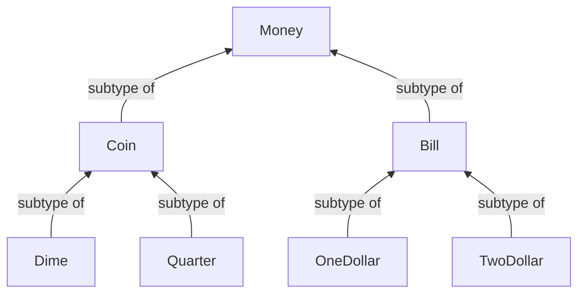

# Variance without Generics

---

> The following is based on concepts from Dave Leeds' video "[Variance without Generics](https://www.youtube.com/watch?v=6moaoAJui_4)", covering content from 00:00 to 07:20.

---

Recall from Java:



**Question**: In Kotlin, is `List<Integer>` a subtype of `List<Any>`? **NO.**

```kotlin
// Example
fun printContents(list: List<Any>) {
    println(list.joinToString())
}
printContents(listOf("abc", "xyz")) // Will this work?
```

## Covariance (Return Type)

Assume now we have this hierarchy for snacks:



Consider the following code:

```kotlin
interface VendingMachine {
    fun purchase(money: Coin): Snack
}

// More specific return type
class SimpleVendingMachine : VendingMachine {
    override fun purchase(money: Coin): CandyBar = Snack.random()
}

// Can we pass CandyBar() whenever we pass a Snack?
class SimpleVendingMachine : VendingMachine {
    override fun purchase(money: Coin): CandyBar = CandyBar()
}
```

A subtype can return a **more specific** type than the parent.

`SimpleVendingMachine` is a subtype of `VendingMachine` (container type), and `CandyBar` is a subtype of `Snack`(return type).

Since both become _more specific_, this is **covariance**.

---

## Contravariance (Parameter Type)

Now consider these hierarchies:



---



A subtype can accept a **more general** type as parameter.

```kotlin
interface VendingMachine {
    fun purchase(money: Coin): Snack
}

// ❌ Error: Quarter is more specific than Coin
class SimpleVendingMachine : VendingMachine {
    override fun purchase(money: Quarter): Snack = CandyBar()
}

// ⚠️ Technically OK: Money is more general, but returning CandyBar() is not allowed
class SimpleVendingMachine : VendingMachine {
    override fun purchase(money: Money): Snack = CandyBar()
}
```

`SimpleVendingMachine` is more specific and now accepts all `Money`, not just `Coin`, and returns a `CandyBar`, not just a `Snack`.

Since the return type becomes _more specific_, while the container type _more general_, this is **contravariance**.

###

#### Function Type Properties

**Kotlin does not allow contravariance directly** because overriding methods must have identical signatures, so the solution is to use function type properties:

```kotlin
interface VendingMachine {
    val purchase: (Coin) -> Snack
}

// ✅ OK: Money is more general, and Snack.random() is more specific
class SimpleVendingMachine : VendingMachine {
    override val purchase: (Money) -> Snack = { Snack.random() }
}
```

# Variance with Generics

## Subtype Relationships

**Example:** A function expecting input of type `Any`:

```kotlin
fun f(a: Any) {
    println(a.toString())
}
```

We can pass a `String` because `String` is a subtype of `Any`.

**Example:** A function expecting input of type `List<Any>`:

```kotlin
fun printContents(list: List<Any>) {
    println(list.joinToString())
}
printContents(listOf("abc", "xyz")) // ✅ OK
```

## Covariance in Kotlin

`List<T>` is _covariant_ → If `A` is a subtype of `B`, then `List<A>` is a subtype of `List<B>`.

```kotlin
val strings: List<String> = listOf("abc", "xyz")
val anyList: List<Any> = strings // ✅ OK
```

This works because immutable lists only allow reading, not modification.

### Why Mutability Breaks This

`MutableList<T>` is NOT covariant.

```kotlin
 // ❌ Error: We dont know what type the other elements have
fun addAnswer(list: MutableList<Any>) {
    list.add(42)
}

// ❌ Error: Compile-time error on addAnswer(strings)
val strings = mutableListOf("abc", "xyz")
addAnswer(strings)
```

Allowing `MutableList<String>` as `MutableList<Any>` would break type safety because

`MutableList<T>` is _NOT_ subtype of `MutableList<Any>` and
`MutableList<Any>` is _NOT_ subtype of `MutableList<T>`.

In other words, they're **invariant**.

#### Key Takeaways

1. `List<T>` (immutable) is covariant (`List<String>` → `List<Any>` is valid).
2. `MutableList<T>` is _invariant_ (`MutableList<String>` ⊄ `MutableList<Any>` and vice versa).

### Variance depends on how a type is used:

**Covariant (out): Safe if only read operations are allowed (List<T>).**
**Contravariant (in): Safe if only write operations are allowed.**
**Invariant: When both read/write are used (MutableList<T>).**

## Invariance in Kotlin

In Java, all classes are _invariant_, but that's not the case in Kotlin.

**A more general fromulation of invariance:**
A generic type `C<T>` is **invariant** if:

- `C<A>`is **not** a subtype of `C<B>` (`C<A>` ⊄ `C<B>`)
- `C<B>`is **not** a subtype of `C<A>` (`C<B>` ⊄ `C<A>`)

This means **no subtype relationship exists** between `C<A>` and `C<B>`, even if `A` is a subtype og `B`.

Like we saw in the example above:

```kotlin
val strings: MutableList<String> = mutableListOf("a", "b")
val anys: MutableList<Any> = strings // ❌ Error: MutableList<T> is invariant
```

## Covarianve in Kotlin (continuing)

Covariance allows **subtype relationships to be perserved** in generics:

If `A` is a subtype of `B`, `Producer<A>` is a subtype of `Producer<B>`, `Producer` is declared with `out T` (only produced, never consumed), then `Producer` is **covariant in T**

```kotlin
interface Producer<out T> {
    fun produce(): T
}
```

Declaring `out T` ensures that `T` can only be returned (produced) from functions but not accepted (consumed) as parameters. This prevents type-safety issues by restricting modifications to the generic type.

Immutable collections like `List<T>` are covariant because they only return elements (`out`), ensuring type safety:

```kotlin
interface List<out T> {
    operator fun get(index: Int): T
}
```

**Example**

Covariance allows subtype relationships to be preserved in generics. If `Cat` is a subtype of `Animal`, we would expect `Herd<Cat>` to be a subtype of `Herd<Animal>`. However, by default, it is not.

```kotlin
class Herd<T : Animal> {
    val size: Int get() = ...
    operator fun get(i: Int): T { /*CODE*/ }
}

fun feedAll(animals : Herd<Animal>) {
    for (i in 0 until animals.size) {
        animals[i].feed()
    }
}

class Cat : Animal() {
    fun cleanLitter() { /*CODE*/ }
}

fun takeCareOfCats(cats : Herd<Cat>) {
    for (i in 0 until cats.size) {
        cats[i].cleanLitter()
    }
    // feedAll() expects Herd<Animal>, but Herd<Cat> is not a subtype of Herd<Animal>
    feedAll(cats) // ❌ Compile error
}

class Herd<out T : Animal> {
    fun addAnimal(animal: T) { /*CODE*/ } // ❌ Error: Consuming T (in)
}
```

**Solution: Declare Covariance with `out`**

```kotlin
class Herd<out T : Animal> {
    val size: Int get() =  // CODE
    operator fun get(i: Int): T { /*CODE*/ } // ✅OK: Only producing (out)
}
```

Since `Herd<out T>` ensures that it only "produces" elements, it is safe to use `Herd<Cat>` where `Herd<Animal>` is expected.

### Summary

- **Covariance (`out`) preserves subtype relationships**: `Herd<Cat>` can be used where `Herd<Animal>` is expected.
- **`out` means "only produce, never consume"**: Methods can return `T`, but not accept it as an argument.
- **Type safety is enforced**: Kotlin prevents unsafe modifications while allowing flexibility in usage.

## Covariance in Kotlin: In-/Out-positions

```kotlin
interface Transformer<T> {
    fun transform(t:T) : T
}
```

**Parameter `T` is in-position** → Consumed as input.
**Return type `T` is out-position** → Produced as output.
**Only out-positions ensure type safety**, so out is used for covariance.

Consider the `List<out T>` interface, which represents immutable lists:

```kotlin
interface List<out T> : Collection<T> {
    operator fun get(index: Int): T //Int in, T out
    fun subList(fromIndex: Int, toIndex: Int): List<T>// Int in (twice), List<T> out
}
```

The `out T` ensures `T` is only used in out-positions, making `List` **covariant in `T`**.

### Revisiting `MutableList<T>`

```kotlin
// MutableList can't be declared covariant because of in-positions
interface MutableList<T> : List<T>, MutableCollection<T> {
    override fun add(element: T): Boolean  // ❌ Error: Consuming T (in)
}
```

## Variance in Constructors

```kotlin
class Herd<out T: Animal>(vararg animals: T) {/* CODE */}
```

Constructor parameters are neither in- nor out-positions because constructors are invoked involuntarily when instances are created.

- **`val` (immutable) parameters:** Treated as out-positions, so covariance is maintained.
- **`var` (mutable) parameters:** Act as both in- and out-positions, which violates covariance.

### Covarianve vs. Visibility Modifiers

#### Rules

- The in/out-position rules apply only to **public**, **protected**, or **internal** methods (i.e., methods visible from outside).
- **Private method parameters are neither in- nor out-positions.**

```kotlin
// leadAnimal is a private parameter, and thus is in a neutral position
class Herd<out T: Animal>(private var leadAnimal: T, vararg animals: T) { /* CODE */}
```

```
// Combinations of in-/out-positions and what they entail:
in + … + in          = in
out + … + out        = out
in + out + …         = both
something + both     = both
something + neutral  = something
```

## Contravariance

Slides: variance in Kotlin vs. Java
