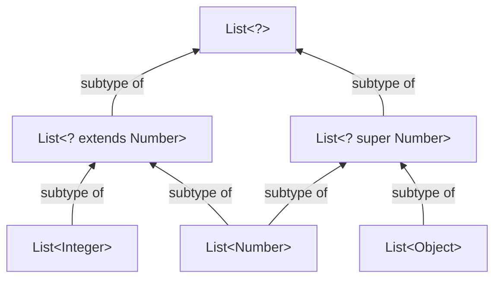
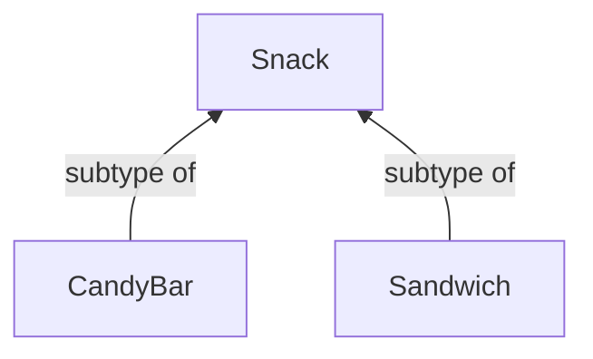
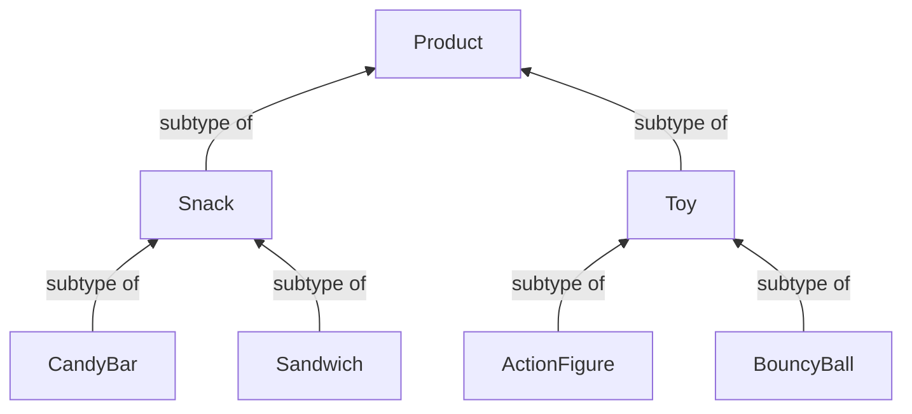
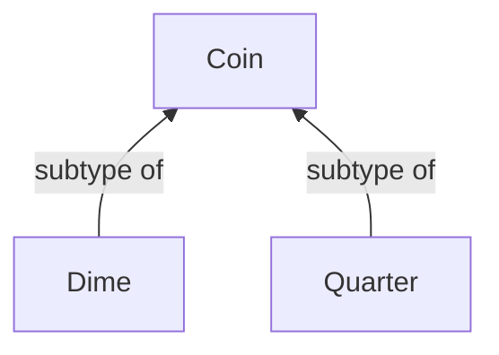
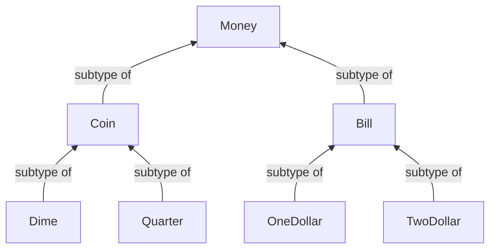

# Variance without Generics

---

> The following is based on concepts from Dave Leeds' video "[Variance without Generics](https://www.youtube.com/watch?v=6moaoAJui_4)", covering content from 00:00 to 07:20.

---

Recall from Java:



**Question**: In Kotlin, is `List<Integer>` a subtype of `List<Any>`? **NO.**

```kotlin
// Example
fun printContents(list: List<Any>) {
    println(list.joinToString())
}
printContents(listOf("abc", "xyz")) // Will this work?
```

## Co-variance (Return Type)

Assume now we have this hierarchy for snacks:



Consider the following code:

```kotlin
interface VendingMachine {
    fun purchase(money: Coin): Snack
}

class SimpleVendingMachine : VendingMachine {
    override fun purchase(money: Coin): CandyBar = CandyBar()
}
```

A subtype can return a **more specific** type than the parent.

`SimpleVendingMachine` is a subtype of `VendingMachine`, and `CandyBar` is a subtype of `Snack`
Since both become _more specific_, this is **covariance**.

---

Now, cosider this hierarchy for the contents in the vending machine, and the form of payment it is able to recieve:



## Contra-variance (Parameter Type)

A subtype can accept a **more general** type as parameter.

```kotlin
interface VendingMachine {
    fun purchase(money: Coin): Snack
}

class SimpleVendingMachine : VendingMachine {
    override fun purchase(money: Money): Snack = Snack.random()
}
```

---



---

`SimpleVendingMachine` is more specific, but now accepts all `Money`, not just `Coin`.
Since one becomes _more specific_, while the other _more general_, this is **contravariance**.

### Function Type Properties

**Kotlin does not allow contravariance directly** because overriding methods must have identical signatures, so the solution is to use function type properties:

```kotlin
interface VendingMachine {
    val purchase: (Coin) -> Snack
}

class SimpleVendingMachine : VendingMachine {
    override val purchase: (Money) -> Snack = { Snack.random() }
}
```



# Variance with Generics
